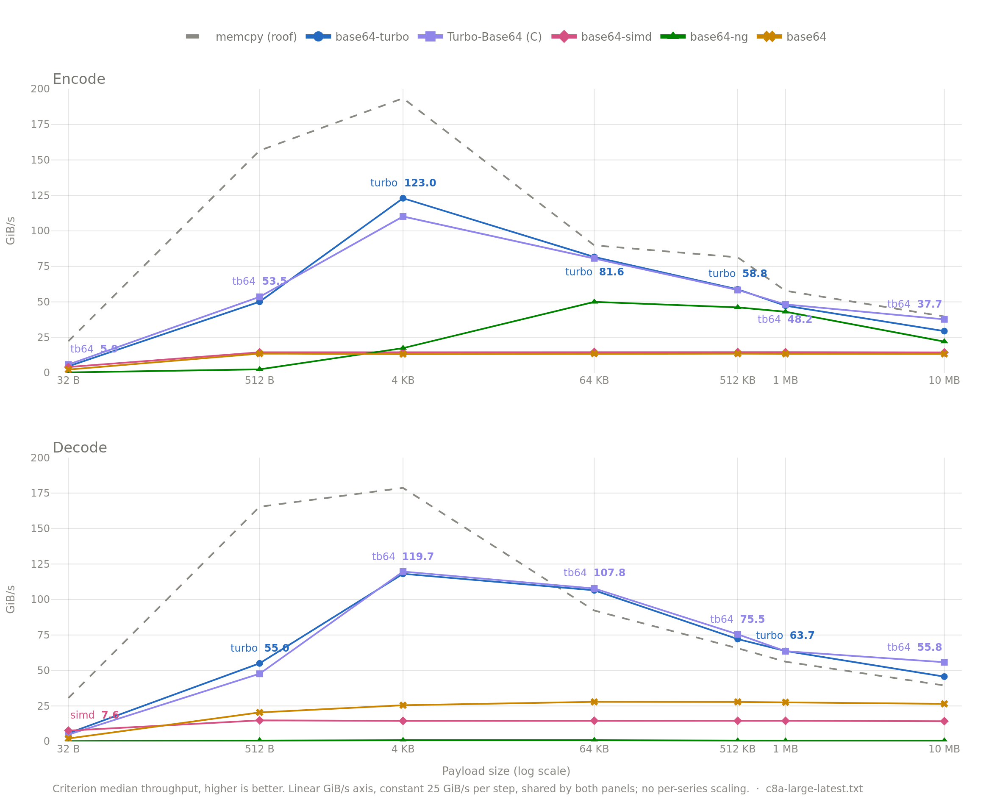
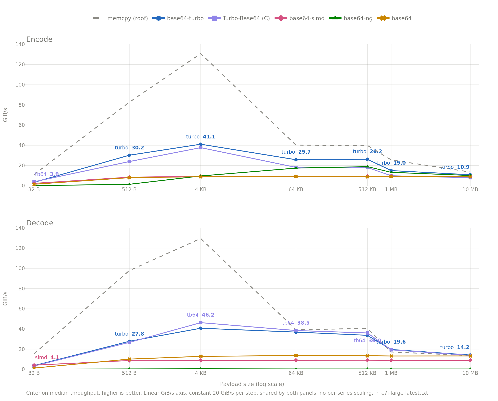

<div align="center">
  <h1>Base64 Turbo</h1>
  <p><strong>A Rust Base64 codec that peaks past 100 GiB/s, with its <code>unsafe</code> SIMD checked by a model checker, not just by review.</strong></p>

  [](https://crates.io/crates/base64-turbo)
  [](https://crates.io/crates/base64-turbo)
  [](https://github.com/hacer-bark/base64-turbo/actions/workflows/verification.yml)
  [](https://github.com/hacer-bark/base64-turbo/actions/workflows/miri.yml)
</div>

<br/>

`base64-turbo` targets high-throughput systems where CPU cycles are scarce and Undefined
Behavior is unacceptable. It picks the best kernel available at runtime:

* **x86_64:** AVX-512 VBMI or AVX2, via runtime CPU detection.
* **ARM (aarch64):** NEON, via compile-time dispatch — no detection overhead.
* **Other:** an optimized table-driven scalar kernel, in 100% safe Rust.



<p align="center"><sub>AWS <code>c8a.large</code> (AMD EPYC 9R45). See <a href="#benchmarks">Benchmarks</a>.</sub></p>

The 100+ GiB/s figures are the peak of the sweep charted above (4 KiB encode, 64 KiB
decode), not a sustained number at every size — [Benchmarks](#benchmarks) has the full
curve and how to reproduce it. We don't claim to beat unchecked C/assembly in general,
but on at least one machine we've measured, we're no longer conceding that fight by
default — see [Ecosystem](#ecosystem). "Memory-safe" here is a specific, bounded
statement; see [Safety & Verification](#safety--verification) for exactly what's proven
and what still rests on human judgment.

If you need WASM SIMD, stable NEON, or a dozen encodings in one crate, this isn't that
crate — see the [FAQ](#faq).

## Contents

- [Quick start](#quick-start)
- [Zero-allocation API](#zero-allocation-stack--no_std)
- [Feature flags](#feature-flags)
- [Compatibility & stability](#compatibility--stability)
- [Performance & architecture](#performance--architecture)
- [Benchmarks](#benchmarks)
- [Safety & verification](#safety--verification)
- [Ecosystem](#ecosystem)
- [FAQ](#faq)
- [Acknowledgements](#acknowledgements)
- [License](#license)

## Quick start

```rust
use base64_turbo::STANDARD;

let data = b"Speed and Safety";
let encoded = STANDARD.encode(data); // String
assert_eq!(encoded, "U3BlZWQgYW5kIFNhZmV0eQ==");

let decoded = STANDARD.decode(&encoded).unwrap(); // Vec<u8>
assert_eq!(decoded, data);
```

### Zero-Allocation (Stack / `no_std`)

For hot paths where heap allocation is too slow, write directly to stack buffers — the
`_into` APIs need no allocator. Size the buffers with `encoded_len`/`estimate_decoded_len`
rather than guessing:

```rust
use base64_turbo::STANDARD;

let input = b"Low Latency";

let mut enc_buf = vec![0u8; STANDARD.encoded_len(input.len())];
let enc_len = STANDARD.encode_into(input, &mut enc_buf).unwrap();

let mut dec_buf = vec![0u8; STANDARD.estimate_decoded_len(enc_len)];
let dec_len = STANDARD.decode_into(&enc_buf[..enc_len], &mut dec_buf).unwrap();

assert_eq!(&dec_buf[..dec_len], input);
```

## Feature flags

Each x86 SIMD kernel is its own knob, so you compile in only what your target CPUs are
likely to support. Runtime detection still gates every call — enabling a kernel the host
lacks just falls back to scalar.

| Feature | Default | Description |
| :--- | :---: | :--- |
| `std` | **Yes** | `String`/`Vec` support. Disable for `no_std` (the `_into` APIs need no allocator). |
| `avx2` | **Yes** | AVX2 kernel + runtime detection on x86/x86_64. Implies `std`. |
| `avx512-vbmi` | **Yes** | AVX-512 VBMI fast-path kernel on x86/x86_64. Implies `std`. |
| `simd` | **Yes** | Convenience meta-feature — turns on `avx2` + `avx512-vbmi` at once. |
| `neon` | **Yes** | NEON acceleration on aarch64. No `std` required. |
| `unstable` | **No** | Exposes the raw internal kernels (`encode_avx2`, `encode_avx512_vbmi`, `encode_neon`, …). The `*_scalar` accessors are **safe** (they may panic on a too-small buffer, but never invoke UB). |

Scalar-only builds are `#![forbid(unsafe_code)]`. Disable every SIMD kernel and the crate
is pure scalar Rust — nothing to verify, nothing to audit. The allocating `encode`/`decode`
swap their uninitialized-buffer fast path for a zero-filled, fully-checked one in this
configuration.

## Compatibility & Stability

**MSRV: Rust 1.89.0.** We rely on recently stabilized AVX-512 intrinsics in `core` and do
not plan to lower this.

The public API is **Stable**. We follow SemVer; the current surface stays valid and
backward-compatible through the `0.3.x` lifecycle.

Output conforms to RFC 4648 — `STANDARD` and `URL_SAFE` are drop-in compatible with the
`base64` crate. `serde` support is not included, to keep the dependency tree empty.

## Performance & Architecture

<details>
<summary>Why is it fast — per-kernel breakdown</summary>

The design goal is maximum throughput *within* Rust's safety guarantees: vectorized data
movement instead of byte-at-a-time lookup tables. We batch 32–64 bytes per register and
push padding/error detection to bitmasks *after* the vector op, so the hot loop stays
branchless.

* **Scalar (wide tables).** 100% safe Rust, `#![forbid(unsafe_code)]`. Encode maps 12
  input bits directly to the two characters they produce (4 lookups per 6-byte block
  instead of 8); decode folds each character's bit-shift into the table itself, so a
  4-character group is four loads OR-ed together and validation falls out of the same OR.
* **AVX2.** `vpshufb` shuffles contend for port 5, so AND/OR/shift work is interleaved
  onto ports 0/1/5 to keep the shuffle port from bottlenecking. 256-bit registers behave
  as two 128-bit lanes, which a sliding bit-stream must cross — bridged with an offset
  load plus a permute instead of dropping to scalar.
* **AVX512-VBMI.** The fastest path we have. `k`-mask registers let the 1–31 byte tail
  run as a single masked vector op instead of a scalar fallback, and 32 `zmm` registers
  (vs 16 `ymm`) keep every LUT resident while unrolling harder. Encode is three ops for
  48 bytes: a `vpermb` gather, one `vpmultishiftqb` that extracts all eight 6-bit fields
  at once, then a `vpermb` through the alphabet. Decode looks up characters with
  `vpermi2b` across a 128-byte reverse LUT and folds validity into a single `vpternlogd`
  OR tree.
* **NEON.** 128-bit `q` registers, 12→16 bytes per encode step. `vqtbl1q_u8` gives the
  same shuffle primitive as `vpshufb`, with full cross-lane access, so no lane-stitching
  is needed. Mandatory on ARMv8-A, hence compile-time dispatch.
* **Dispatch.** x86 picks AVX-512 VBMI → AVX2 → scalar at runtime (guarding against
  `SIGILL`); aarch64 picks NEON → scalar at compile time.

</details>

## Benchmarks

Straight `cargo bench` output (`benches/encoding_bench.rs`) — same numbers charted at the
top of this README, no cherry-picking.
[criterion.rs](https://github.com/bheisler/criterion.rs), 5 s warm-up, 15 s measurement
per group. Input sizes span 32 B → 10 MB to cross L1/L2/RAM boundaries. `std` is the
`base64` crate on default features — since 0.23 that means its `simd-unsafe` path
(AVX2/NEON with runtime detection) is active, not the old scalar-only engine, so this is
the number most callers of that crate actually get.

**AWS `c8a.large` (AMD EPYC 9R45), the chart above:** at 64 KiB, `base64-turbo` hits
81.1 GiB/s encode / 107.5 GiB/s decode, vs 14.6 / 14.6 GiB/s for `base64-simd`
(+467% / +637%) and 9.8 / 25.6 GiB/s for the `base64` crate (+744% / +321%). The sweep
peaks at 105.6 GiB/s encode (4 KiB) and 107.5 GiB/s decode (64 KiB) — both comfortably
past 100 GiB/s, single-threaded, from a Kani/MIRI/MSan-checked kernel rather than an
unaudited one. Small-input latency (32 B, zero-alloc `_into`): ~7.4 ns encode,
~10.0 ns decode.

<details>
<summary>AWS <code>c7i.large</code> (Intel Xeon Platinum 8488C) — smaller/cheaper box, same methodology</summary>



At 64 KiB: 30.9 GiB/s encode / 46.7 GiB/s decode, vs 11.1 / 10.2 GiB/s for `base64-simd`
(+179% / +358%) and 6.9 / 13.2 GiB/s for the `base64` crate (+348% / +254%). Small-input
latency (32 B, zero-alloc `_into`): ~10 ns encode, ~13 ns decode. The two machines agree
on the shape of the curve (same dip past L2/L3, same relative ordering of libraries) and
disagree by roughly 2-3x on the absolute ceiling — which is itself the point: the
100+ GiB/s number is a real peak on real hardware, not a property of the algorithm that
holds everywhere.

</details>

Reproduce it:

```bash
sudo apt update && sudo apt install -y build-essential git
curl --proto '=https' --tlsv1.3 -sSf https://sh.rustup.rs | sh -s -- -y
source "$HOME/.cargo/env"

git clone https://github.com/hacer-bark/base64-turbo
cd base64-turbo
BENCH_TARGET=all cargo bench 2>&1 | tee benches/results/raw.txt
python3 benches/scripts/plot_bench.py benches/results/raw.txt
```

Select comparison targets with `BENCH_TARGET` (comma-separated): `turbo` (default,
allocating API), `turbo-buff` (zero-allocation API), `simd`, `std`, `all`.

<details>
<summary>Raw <code>cargo bench</code> output — AWS <code>c8a.large</code>, <code>BENCH_TARGET=all</code></summary>

See [`benches/results/c8a-large-latest.txt`](benches/results/c8a-large-latest.txt) for the
full unedited output — 32 B through 10 MB, every target.

</details>

<details>
<summary>Raw <code>cargo bench</code> output — AWS <code>c7i.large</code>, <code>BENCH_TARGET=all</code></summary>

See [`benches/results/c7i-large-latest.txt`](benches/results/c7i-large-latest.txt) for the
full unedited output — 32 B through 10 MB, every target.

</details>

## Safety & Verification

**Philosophy:** `Safety > Performance > Convenience`. We use `unsafe` SIMD intrinsics and
raw pointer arithmetic, so rather than rely on review alone we stack independent layers
that cover each other's blind spots.

| Architecture | MIRI | MSan | Kani | Fuzzing |
| :--- | :---: | :---: | :---: | :---: |
| **AVX2** | ✅ | ✅ | ✅ | ✅ |
| **AVX512-VBMI** | ✅ | ✅ | ✅ | ✅ |
| **NEON** | ✅ | ✅ | ❌ | ❌ |

* **Kani** proves the kernels don't panic, don't read/write out of bounds, and agree with
  the safe scalar kernel. For AVX2 and AVX512-VBMI the bounds result holds for *every*
  input length by a machine-checked induction over the loop's offset arithmetic — not
  just the lengths a harness happens to unwind. Two exclusions are worth naming rather
  than burying: AVX2's non-temporal store path (it needs a 4 MiB input, far past what a
  model checker can unwind, so its 16-byte alignment precondition rests on a hardware
  test instead), and AVX512-VBMI's 4×-unrolled quad tiers (256 symbolic characters
  through four `vpermi2b` lookups is out of CBMC's reach — the *arithmetic* of those
  tiers is proved, but no harness executes one).
* **MIRI** catches Undefined Behavior (provenance, alignment, OOB pointer arithmetic,
  data races) on every distinct code path — single-vector loop, wide unrolled loop,
  masked tail, scalar tail — for Scalar, AVX2 and AVX512-VBMI. Branch coverage, not
  exhaustive input coverage.
* **MSan** rebuilds the standard library with instrumentation
  (`-Z build-std -Z sanitizer=memory`) to confirm we never branch on or emit
  uninitialized memory, which matters given how much AVX512-VBMI masking we do.
* **Fuzzing** — 2.5B+ `cargo-fuzz` iterations across all paths, no crashes to date.

<details>
<summary>What still rests on human judgment</summary>

1. The index proofs that make the bounds hold for every length mirror the loops' offset
   arithmetic; they don't execute it. Every stride is now imported from the kernel
   module rather than restated in the proof, so a stride can't change under a proof
   without changing it too — but the *shape* of the model is still hand-written, and a
   restructured loop needs a restructured proof.
2. Kani can't execute SIMD, so each intrinsic it meets is a line-by-line Rust
   transcription of the Intel Intrinsics Guide pseudocode. `avx2_stub_equivalence` and
   `avx512_vbmi_stub_equivalence` (`cargo test`) run every model against the real
   instruction on real hardware, each skipping if the host lacks the subset. They catch
   transcription errors; they don't prove the models agree everywhere.
3. Two paths are proved by arithmetic but never executed by a proof: AVX2's non-temporal
   store tier (4 MiB minimum input — its `_mm_stream_si128` alignment precondition is
   covered by `avx2_encode_non_temporal` on hardware instead) and both AVX512-VBMI quad
   tiers (too much symbolic state for CBMC). In each case the offsets are proved for
   every length; it is the *contents* no harness checks.
4. NEON has no Kani harness at all, and rests on MIRI, MSan and fuzzing.

Read the [CI logs](https://github.com/hacer-bark/base64-turbo/actions) and the `unsafe`
blocks themselves — each documents the contract it relies on.

</details>

## Ecosystem

| Library | Lang | SIMD | Verified `unsafe` | Encode (64 KiB) | Decode (64 KiB) | Source |
| :--- | :---: | :---: | :---: | ---: | ---: | :--- |
| **base64-turbo** | Rust | ✅ | ✅ Kani + MIRI + MSan + Fuzz | 27.1 GiB/s | 34.6 GiB/s | our bench, same box † |
| [Turbo-Base64](https://github.com/powturbo/Turbo-Base64) | C | ✅ | ❌ | 18.4 GiB/s | 37.8 GiB/s | our bench, same box † |
| [base64](https://crates.io/crates/base64) (std) | Rust | ✅ (0.23+) | ✅ MIRI + Fuzz | 6.9 GiB/s | 13.2 GiB/s | our bench |
| [base64-simd](https://crates.io/crates/base64-simd) | Rust | ✅ | ❌ | 11.1 GiB/s | 10.2 GiB/s | our bench |
| [base64-ng](https://crates.io/crates/base64-ng) | Rust | ✅ | ❌ | — | — | not yet benched |
| [aklomp/base64](https://github.com/aklomp/base64) | C | ✅ | ❌ | 24.4 GiB/s | 21.0 GiB/s | vendor bench |
| [fastbase64](https://github.com/lemire/fastbase64) | C | ✅ | ❌ | 22.1 GiB/s | 19.8 GiB/s | vendor bench |

All Rust rows (except `base64-ng`) and the Turbo-Base64 row are ours, measured on the same
AWS `c7i.large` in the same session — we cloned Turbo-Base64's real upstream C source,
built it with its own official per-kernel flags (its `tb64v512vbmi` kernel auto-selects on
this CPU, confirmed at runtime), verified our harness round-trips and rejects corrupt
input the same as its own checked decode, and ran both back to back, pinned to one core.

† — We wrote the C-side timing harness ourselves rather than using theirs, matched to our
criterion methodology as closely as a hand-rolled harness reasonably can — solid, but it's
one measurement session, not the statistical rigor criterion gives the Rust numbers, so
treat the margins as directional rather than exact. On that comparison, we're ahead on
both encode and decode — by a wide margin on encode, a smaller one on decode — which is
close enough on the decode side that we no longer assume unchecked C is automatically
ahead here, though we're not claiming a general win either. The aklomp/base64 and
fastbase64 rows are still the vendors' own published numbers on an Intel i7-9700K from
2022
([source](https://github.com/powturbo/Turbo-Base64#benchmark-incl-the-best-simd-base64-libs),
decimal MB/s converted to GiB/s), unreproduced by us — treat those two as directional
only.

`base64` (std) added a SIMD path in 0.23 (the default-on `simd-unsafe` feature, AVX2/NEON
with runtime detection) — it's no longer the zero-`unsafe` scalar crate it used to be, and
we bench it as most users get it, default features on. It publishes MIRI and fuzz coverage
for that path but no Kani or MSan, which is the gap the two extra layers in
[Safety & Verification](#safety--verification) close for us. `base64-simd` is a strong
crate that raised the bar before us; we measure faster overall on this box and publish
Kani/MIRI/MSan we couldn't find for it. `base64-ng` is a newer entrant we haven't
benchmarked yet — no speed claim either way until we have numbers. The C libraries still
get real advantages from unchecked pointer arithmetic and no published verification
(`turbo-base64` is also GPLv3, against our MIT-or-Apache-2.0) — pick them if you need the
absolute ceiling on unfamiliar hardware and will own the risk.

Also in the space: [vb64](https://crates.io/crates/vb64) (unmaintained),
[base-d](https://crates.io/crates/base-d) (33+ alphabets, decode-only SIMD),
[webbuf](https://crates.io/crates/webbuf) and [baste64](https://crates.io/crates/baste64)
(WASM-oriented). None of these publish Kani or MIRI verification of their `unsafe` code,
as far as we could find.

## FAQ

**Why no SSE, WASM, or other SIMD backends?**
We optimize for one target class — x86 with AVX2 or AVX-512 VBMI — rather than spreading
across every instruction set a CPU might expose. Every additional backend is another
kernel to prove safe, another set of intrinsics to verify against real hardware, another
surface for a transcription bug to hide in; we're not willing to maintain tens of
thousands of lines of unaudited SIMD to chase a feature checklist. Even NEON is Alpha —
it has no Kani proofs (see [Safety & Verification](#safety--verification)) and may be
deprecated in a future release. If you need WASM SIMD or a crate that runs everywhere,
look elsewhere; if you need a verified, maximally fast encoder for machines with AVX2 or
AVX-512 VBMI, that's what this crate is for.

**Is NEON production-ready?**
No. It compiles and passes MIRI/MSan/tests, but it hasn't had the symbolic Kani proofs
that cover AVX2 and AVX512-VBMI, and CI doesn't run it on real ARM hardware yet (see
[SIMD local verification](#compatibility--stability)). Treat it as best-effort until it
gets the same treatment as the x86 kernels.

**Does this replace the `base64` crate?**
For most callers, yes — `STANDARD` and `URL_SAFE` are drop-in RFC 4648 compatible. The
difference is throughput and verification depth (see [Ecosystem](#ecosystem)), not API
surface. If you need alphabets beyond standard/URL-safe or don't care about the last
20-80 GiB/s, the `base64` crate is a perfectly reasonable, smaller dependency.

**Why is `unsafe` acceptable here at all?**
Because vectorized Base64 cannot be written in safe Rust and hit these throughput
numbers — the SIMD intrinsics themselves require `unsafe`. Our answer is to prove the
`unsafe` correct with multiple independent tools (Kani, MIRI, MSan, fuzzing) instead of
asking you to trust code review alone. Scalar-only builds drop `unsafe` entirely
(`#![forbid(unsafe_code)]`) if you'd rather not carry any of it.

**What happens on a CPU without AVX2 or AVX-512 VBMI?**
Runtime detection falls back to the scalar kernel automatically — no crash, no manual
feature gating required at the call site. You lose the SIMD throughput, not correctness
or safety.

## Acknowledgements

The encode/decode kernels build on techniques published by others, all under permissive
licenses:

* **[Alfred Klomp](https://github.com/aklomp) — [`aklomp/base64`](https://github.com/aklomp/base64) (BSD-2-Clause).**
  Our decoder's nibble-lookup validation and our encoder's offset-load loop and
  single-LUT character mapping are direct ports from this library. The URL-safe tables
  aren't published anywhere we could find — we re-derived them and verified them
  exhaustively (`src/simd/avx2.rs`).
* **[Daniel Lemire](https://github.com/lemire) and Wojciech Muła — [`lemire/fastbase64`](https://github.com/lemire/fastbase64) (BSD-2-Clause).**
  `fastavxbase64.c` independently documents the same nibble-lookup decode algorithm
  (originated by Muła, `+`/`/` disambiguation credited there to `@aqrit`), which we
  cross-referenced while implementing ours.
* **[`base64-simd`](https://crates.io/crates/base64-simd) (MIT).** Its benchmarks and API
  design were a useful reference point throughout.

## License

Licensed under either of

- [Apache License, Version 2.0](https://github.com/hacer-bark/base64-turbo/blob/main/LICENSE-APACHE)
- [MIT license](https://github.com/hacer-bark/base64-turbo/blob/main/LICENSE-MIT)

at your option.

Unless you explicitly state otherwise, any contribution intentionally submitted for inclusion in
this crate, as defined in the Apache-2.0 license, shall be dual licensed as above, without any
additional terms or conditions.
